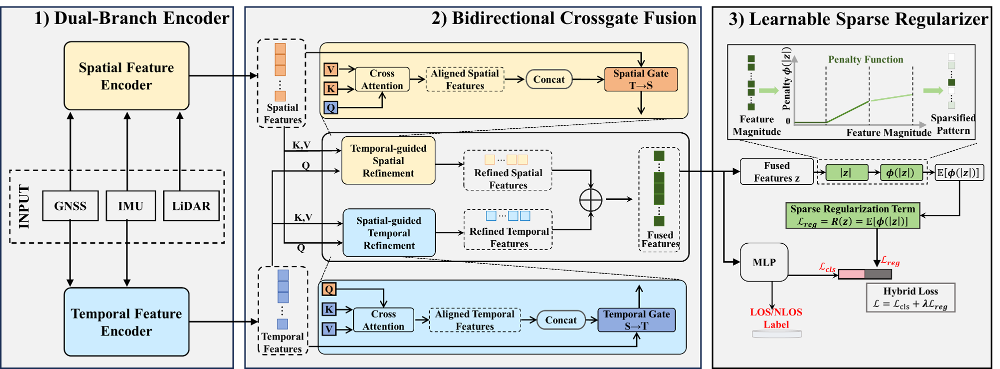

# CrossGate LOS/NLOS Core Framework

This repository keeps only the core method framework for the figure-level architecture.
It is not intended to run out of the box.



1. Dual-Branch Encoder
2. Bidirectional CrossGate Fusion
3. Learnable Sparse Regularizer

It intentionally does not include private project paths, concrete data preprocessing, runnable training scripts, plotting scripts, checkpoint logic, or result-management code. Users must implement their own project configuration and data adapter before running experiments.

## Structure

```text
code_git_core/
  assets/
    fig1.png
  configs/
    project_config.template.yaml
  src/
    multimodal_nlos/
      config.py
      data/
        interfaces.py
      models/
        encoders.py
        crossgate.py
        sparse_regularizer.py
        classifier.py
      training/
        losses.py
  README.md
  requirements.txt
  pyproject.toml
```

## Figure Alignment

- **Dual-Branch Encoder**
  - `TemporalFeatureEncoder` encodes GNSS/IMU temporal sequences.
  - `SpatialFeatureEncoder` encodes GNSS, IMU, LiDAR, and satellite/context features.
  - `DualBranchEncoder` returns spatial and temporal feature vectors.

- **Bidirectional CrossGate Fusion**
  - `Temporal-guided Spatial Refinement`: temporal feature as query, spatial feature as key/value context.
  - `Spatial-guided Temporal Refinement`: spatial feature as query, temporal feature as key/value context.
  - Each direction follows: cross-attention -> aligned feature -> concat -> gate -> refined feature.
  - The two refined features are fused into final feature `z`.

- **Learnable Sparse Regularizer**
  - `LearnableSparseRegularizer` applies a learnable piecewise penalty to fused feature `z`.
  - `hybrid_loss` combines classification loss and sparse regularization loss.

## What Is Intentionally Missing

This repository does not provide a runnable pipeline. The following parts must be configured or implemented by the user:

- project-specific GNSS, IMU, LiDAR, and satellite data readers
- timestamp synchronization and sample construction rules
- feature dimensions matching the user's private preprocessing pipeline
- train/validation split strategy
- optimizer, scheduler, epoch loop, logging, and checkpoint saving
- experiment paths and result-export policy

The template below only documents the required configuration surface; it is not a valid runnable config until edited:

```text
configs/project_config.template.yaml
```

The tensor schema expected by the model is documented in:

```text
src/multimodal_nlos/data/interfaces.py
```

## Scope

This code is a method skeleton for sharing the CrossGate architecture, not a turnkey reproduction package.
